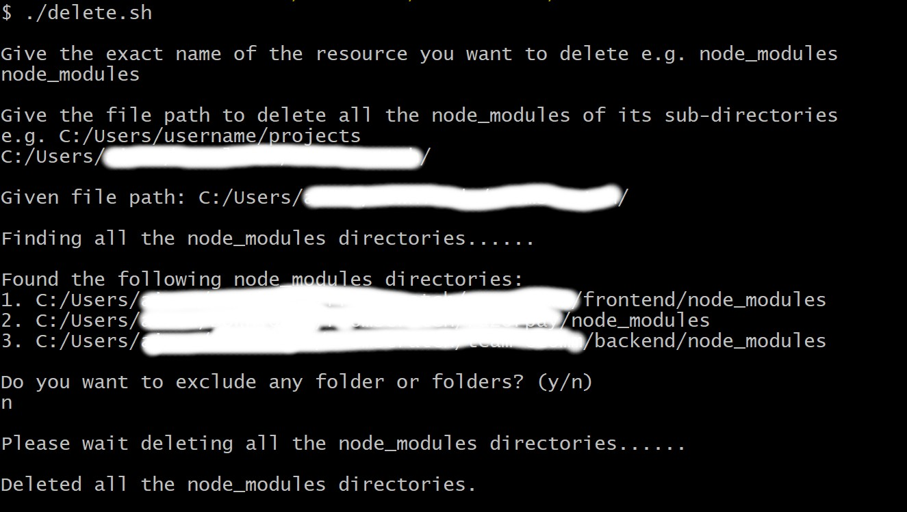

# dscript
This is a bash script you can use this script to find and delete all the unused dependencies, build files, e.g. node_modules etc which are not required currently maybe you are not working on those projects but taking up your disk space.

## Usage
Currently in this script you can specify the resource file name you want to delete e.g. node_modules and the directory under which
all the resources matching the resource file name you want to delete from.

### Here is a demo of the script

